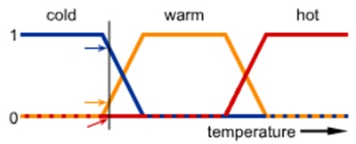

---
# Informació general del document
title: Models d'Intel·ligència Artificial
subtitle: 
authors: 
    - Fidel Oltra Landete
lang: ca
page-background: img/bg.png

# Portada
titlepage: true
titlepage-rule-height: 0
# titlepage-rule-color: AA0000
# titlepage-text-color: AA0000
titlepage-background: img/portada.png
# logo: img/logotext.png

# Taula de continguts
toc: true
toc-own-page: true
toc-title: Continguts

# Capçaleres i peus
header-left: Unitat 02 - Models d'Intel·ligència Artificial
header-right: Curs 2025-2026
footer-left: IES Jaume II El Just
footer-right: \thepage/\pageref{LastPage}

# Imatges
float-placement-figure: H
caption-justification: centering

# Llistats de codi
listings-no-page-break: false
listings-disable-line-numbers: false

header-includes:
     - \usepackage{lastpage}
---

# Models d'IA. Mètodes de representació.

En esta unitat anem a treballar amb el concepte de **model** en el camp de la intel·ligència artificial (IA). Veurem la seua definició, quins tipus de models existeixen, i quines aplicacions poden tindre en la pràctica. 

També veurem quins són els requeriments bàsics d'un sistema de resolució de problemes i dels diferents models d'IA. Per exemple, automatització de tasques, sistemes de raonament imprecís, sistemes basats en regles, i algorismes de cerca i optimització.

## Què és un model?

Un **model** és una representació simplificada d'un sistema o fenomen que permet analitzar-lo, entendre'l i fer prediccions sobre el seu comportament. En el context de la intel·ligència artificial, un model és una **estructura matemàtica o computacional que captura les relacions entre les dades d'entrada i les sortides esperades**. Un model s'entrenarà amb dades per aprendre a fer prediccions o a prendre decisions basades en aquesta informació.

## Models i algorismes.

Els **models** i els **algorismes** són conceptes relacionats però diferents en el context de la intel·ligència artificial. Un **algorisme** és un conjunt de regles o passos que es segueixen per resoldre un problema o realitzar una tasca específica, mentre que un **model** és la representació del coneixement adquirit a partir de les dades. Per a que un model funcione, necessita ser entrenat amb un o varis algorismes, que són els que permeten ajustar els paràmetres del model per tal que aquest puga fer prediccions o prendre decisions. Els models poden ser entrenats o no entrenats, depenent del tipus d'aprenentatge que s'utilitze.

Els **models entrenats** serien aquells que han passat per un procés d'aprenentatge automàtic, on s'ajusten els seus paràmetres a partir de dades d'entrenament. Això permet que el model aprenga a generalitzar i a fer prediccions sobre dades noves. Un exemple seria un model de classificació que ha estat entrenat amb un conjunt de dades etiquetades per identificar diferents categories, tipus d'animals, etc. Estariem parlant de models de **Machine Learning** o **Deep Learning**, dos tipus d'aprenentatge automàtic que se corresponen amb **IA basada en dades**.

Els **models no entrenats**, en canvi, són aquells que no han passat per un procés d'aprenentatge automàtic i, per tant, no tenen paràmetres ajustats. Aquests models poden ser utilitzats per a tasques específiques on no es requereix aprenentatge previ, com ara models basats en regles o sistemes de raonament simbòlic. Estariem parlant, com hem vist en la introducció, de **IA simbòlica o basada en regles**. Un **sistema expert** és un exemple de model no entrenat, ja que es basa en regles i coneixements predefinits per resoldre problemes específics en un domini particular. En canvi, un model de xarxa neuronal seria un exemple de model entrenat, ja que requereix un procés d'entrenament per ajustar els seus pesos i connexions a partir de dades d'entrenament. Este tipo de model és **determinista**, és a dir, que per a una entrada donada sempre produirà la mateixa sortida. 

## Més tipus de models.

Podem fer altres classificacions més especialitzades dels models d'IA. Per exemple, podem diferenciar entre models d'IA basats en regles i models d'aprenentatge automàtic, com hem vist, però també podem parlar de **models de raonament imprecís**, **models generatius**, **models discriminatius**, **models de cerca i optimització**, **models de processament del llenguatge**, etc. Cada tipus de model té les seues pròpies característiques i aplicacions. 

Dins dels models d'aprenentatge automàtic, podem distingir entre:

- **Models supervisats**: Són entrenats amb dades etiquetades, on cada entrada té una sortida coneguda. L'objectiu és aprendre una funció que siga capaç de predir la sortida per a noves entrades. Dins dels models supervisats, podem trobar **models de classificació** (per exemple, per identificar si un correu electrònic és spam o no) i **Models de regressió** (per exemple, per predir el preu d'una casa en funció de les seues característiques).
- **Models no supervisats**: Són entrenats amb dades no etiquetades, on l'objectiu és descobrir patrons o estructures ocultes en les dades. Per exemple, els models de **Clustering** (agrupament) poden identificar grups de dades similars sense necessitat d'etiquetes prèvies. També podem utilitzar este tipus de models en els **sistemes de recomanació**, on es busca agrupar usuaris o productes en funció de les seues preferències.
- **Models de reforç**: Són entrenats utilitzant un sistema de recompenses i càstigs, on l'agent aprèn a prendre decisions per maximitzar la seua recompensa a llarg termini.

Cada vegada s'utilitzen més els **sistemes híbrids**, que combinen diferents tipus de models per aprofitar les seues fortaleses i minimitzar les seues debilitats. Per exemple, un sistema pot utilitzar un model basat en regles per a la presa de decisions inicials i un model d'aprenentatge automàtic per millorar la precisió de les prediccions a mesura que es disposa de més dades.

Tots els tipus de models que tinguen a veure amb l'aprenentatge automàtic s'estudiaran en més detall al mòdul de **Sistemes d'Aprenentatge Automàtic** del Curs d'Especialització.

## Aplicacions.

Els models d'IA tenen una àmplia gamma d'aplicacions en diversos camps. Algunes de les aplicacions més comunes inclouen:

- **Reconeixement de veu**: Els sistemes de reconeixement de veu converteixen la parla en text i poden automatitzar la transcripció de documents o ordres de veu en dispositius. Per exemple, aplicacions de reconeixement de veu com Google Speech-to-Text o Microsoft Azure Speech Service permeten convertir enregistraments de veu en text escrit de manera automatitzada.
- **Reconeixement i processament d'imatges**: Els models d'IA poden identificar objectes, persones o escenes en imatges i vídeos, utilitzats en aplicacions de seguretat, automoció i salut. Per exemple, els sistemes de reconeixement facial poden identificar persones en fotografies o vídeos, millorant la seguretat en espais públics o facilitant l'accés a dispositius. Altres aplicacions de l'anàlisi d'imatges podria ser la detecció de tumors en radiografies o en la identificació de productes en imatges de comerç electrònic. Per exemple, els sistemes de visió per computador poden analitzar imatges mèdiques per detectar anomalies o lesions, millorant així el diagnòstic i el tractament dels pacients.
- **Sistemes de recomanació**: Els models d'IA poden analitzar les preferències dels usuaris i suggerir productes, pel·lícules, música o altres continguts personalitzats. Per exemple, plataformes com Netflix o Spotify utilitzen sistemes de recomanació per oferir contingut adaptat als gustos dels seus usuaris.
- **Detecció de patrons i anomalies**: Els models d'IA poden identificar patrons en grans volums de dades i detectar anomalies que podrien indicar problemes o oportunitats. Per exemple, en el sector financer, els models d'IA poden analitzar transaccions per identificar patrons de comportament normal i detectar desviacions que podrien indicar frau o errors.
- **Assistents virtuals**: Els assistents virtuals com Siri, Alexa o Google Assistant utilitzen models d'IA per entendre i respondre a les consultes dels usuaris, automatitzant tasques com la programació d'esdeveniments o la recerca d'informació. Per exemple, un assistent virtual pot ajudar a gestionar el calendari personal, enviar missatges o controlar dispositius intel·ligents a casa.
- **Processament del llenguatge natural (NLP)**: Els models d'IA poden analitzar i generar text en llenguatge natural, utilitzats en traducció automàtica, anàlisi de sentiments i generació de contingut. Per exemple, els sistemes de traducció automàtica com Google Translate utilitzen models d'IA per traduir textos entre diferents idiomes de manera precisa i ràpida.
- **Robòtica i automatització**: Els models d'IA poden controlar robots i sistemes automatitzats per realitzar tasques complexes, com ara en la fabricació, la logística o l'agricultura. Per exemple, els robots industrials equipats amb models d'IA poden realitzar tasques de muntatge, soldadura o embalatge de manera eficient i precisa. Els vehicles autònoms també utilitzen models d'IA per percebre l'entorn, prendre decisions i navegar de manera segura.

> Un **LLM** (Large Language Model) és un tipus de model d'IA dissenyat per processar i generar text en llenguatge natural. Aquests models utilitzen tècniques d'aprenentatge automàtic per aprendre les estructures i patrons del llenguatge a partir de grans volums de dades textuals. Els LLM són capaços de realitzar tasques com la traducció automàtica, la generació de text coherent, la resposta a preguntes i l'anàlisi de sentiments.

## Representació del coneixement.

La **representació del coneixement** és un aspecte fonamental en la intel·ligència artificial, ja que permet als sistemes d'IA emmagatzemar, organitzar, entendre i utilitzar la informació de manera eficient.

### Jerarquia del coneixement.

Per entendre com representar el coneixement, és interessant entendre primer què és coneixement en realitat. Hi ha un esquema anomenat **Piràmide del coneixement** o també **Jerarquía DIKW** que ens ajudarà a entendre com es relacionen els diferents nivells de coneixement. Esta jerarquia es pot dividir en quatre nivells:

- **Data (dades)**: Són fets o valors sense context ni significat. Per exemple, un número, una paraula o una mesura. Les dades són la base de la informació, però per si soles no tenen cap significat. Per exemple, imaginem un 38. Què significa? No ho sabem, perquè no tenim un context. Pot ser la temperatura d'un dia, l'edat d'una persona, o el nombre de persones en una sala. Sense més informació, no podem interpretar el seu significat.
- **Information (Informació)**: És el resultat de processar les dades i donar-los un context. Per exemple, si diem "La temperatura és de 38 graus", estem proporcionant informació que té un significat clar. La informació és útil perquè ens permet entendre millor les dades i prendre decisions basades en elles. Ara eixe 38 ja té un significat, podem interpretar-lo i utilitzar-lo en el nostre sistema de representació de coneixement i presa de decisions.
- **Knowledge (Coneixement)**: És la comprensió i l'aplicació de la informació integrada dins d'un context més ampli i fent ús de regles o coneiximents previs. Per exemple, en el nostre cas, sabem que una temperatura de 38 graus pot ser un símptoma de febre, i que això pot indicar que una persona està malalta. El coneixement implica la capacitat d'aplicar la informació a situacions específiques i de prendre decisions informades.
- **Wisdom (Saviesa)**: És la capacitat de prendre decisions i actuar de manera ètica i responsable basant-se en el coneixement adquirit. La saviesa implica no només comprendre la informació i el coneixement, sinó també saber com aplicar-los de manera adequada en situacions complexes. De vegades se parla de la saviesa com d'un ***metaconeixement***, és a dir, saber què fer amb eixe coneixement que acabem d'adquirir. Per exemple, si sabem que una persona té 38º de temperatura corporal, i también sabem que això és febre, podem decidir recomanar-li que vagi al metge, que es quede a casa per descansar o fins i tot que prenga cert medicament.

### Representació.

La representació del coneixement és un dels problemes fonamentals en el món de l'intel·ligència artificial. Podem definir representació del coneixement com el procés de codificar la informació i les relacions entre diferents conceptes d'una manera que els sistemes d'IA puguen entendre i utilitzar. En el procés ens trobarem molts obstacles, atés que la quantitat d'informació i coneixement que necessitem gestionar és enorme (tot el coneixement del món?), i que la seua representació moltes vegades és verbal o esquemàtica i cal traduir-la d'alguna manera que siga interpretable pels sistemes d'IA. 

Hi ha diverses tècniques i estructures per a representar el coneixement. Algunes de les més destacades són:

- **Regles de producció**: Són regles que defineixen relacions entre condicions i accions. Per exemple, *Si plou, agafa el paraigües*. Aquestes regles es poden utilitzar en sistemes basats en regles per a la presa de decisions.
- **Ontologies**: Són estructures que representen coneixements sobre un domini específic, incloent classes, atributs i relacions entre ells. Les ontologies permeten una representació més rica i estructurada del coneixement, facilitant la interoperabilitat entre diferents sistemes. Per exemple, una ontologia sobre animals podria incloure classes com "Mamífers", "Aus" i "Rèptils", amb atributs com "nom", "color" i relacions com *un gat és un tipus de mamífer*.
- **Grafos de coneixement**: Són representacions que utilitzen nodes i arestes per modelar relacions entre entitats. Els grafos de coneixement són útils per representar informació complexa i interrelacionada, com ara les relacions entre persones, llocs i esdeveniments. Hi pot haver una relació jeràrquica entre les entitats, com ara *un gat és un tipus d'animal*, o altres relacions no necessàriament jeràrquiques, com *un autor ha escrit un llibre*.
- **Lògiques formals**: Són sistemes matemàtics que permeten representar coneixements i raonar sobre ells. Hi ha diferents tipus de lògiques formals, com ara la lògica proposicional, la lògica de primer ordre i la lògica difusa. Aquestes lògiques són útils per a la representació del coneixement en sistemes experts i en la resolució de problemes complexos.
    - **Lògica de primer ordre o de predicats**: És un sistema formal que permet representar afirmacions i raonar sobre elles utilitzant quantificadors i predicats. La lògica de primer ordre és útil per a la representació del coneixement en sistemes experts i en la resolució de problemes complexos. Exemples: 
    - *Tots els humans són mortals* es pot representar com ∀x (Humà(x) → Mortal(x)).
    - *Hi ha almenys un gat que és negre* es pot representar com ∃x (Gat(x) ∧ Negre(x)).
    - **Lògica proposicional**: És un sistema formal que utilitza proposicions i operadors lògics per representar coneixements i raonar sobre ells. La lògica proposicional és útil per a la representació de coneixements senzills i per a la resolució de problemes lògics. Exemples:
    - *Si plou, llavors el terra està mullat* es pot representar com P → Q, on P és *plou* i Q és *el terra està mullat*. La fletxa → indica una implicació lògica.
    - *El sol brilla o està núvol* es pot representar com P ∨ Q, on P és *el sol brilla* i Q és *està núvol*. El símbol ∨ indica una disjunció lògica, que significa que almenys una de les dues proposicions és certa.
    - **Lògica difusa**: És una extensió de la lògica proposicional que permet representar incerteses i graus de veritat. La lògica difusa és útil per a la representació del coneixement en sistemes que impliquen raonament imprecís o subjectiu, com ara en la presa de decisions en situacions amb informació incompleta o amb variables contínues. Exemples:
    - *La temperatura és fresca* es pot representar com un valor difús entre 0 i 1, on 0 significa *no és fresca* i 1 significa *és fresca*.
    - *El nivell d'estrès és moderat* es pot representar com un valor difús que indica el grau d'estrès en una escala de 0 a 1.
    - *El grau de satisfacció del client és alt* es pot representar com un valor difús que indica el nivell de satisfacció en una escala de 0 a 1.

    

## Representació de problemes i sistemes de resolució. Requeriments bàsics.

De la mateixa forma que hem de ser capaços de representar el coneixement per a poder utilitzar-lo, també hem de ser capaços de representar els problemes que volem resoldre. La representació del problema és fonamental per a la seua resolució efectiva. En general hem de poder definir un punt de partida, un lloc al que volem arribar, quines són les possibles accions per aconseguir-ho, i quines són les restriccions o condicions que hem de tindre en compte. Això ens permetrà dissenyar un sistema de resolució de problemes que siga capaç d'analitzar el problema i proposar solucions.

Els requeriments bàsics per a un sistema de resolució de problemes inclouen:

- **Definició clara del problema**: És fonamental entendre quin és el problema que es vol resoldre, incloent els objectius i les restriccions.
- **Modelització del problema**: Representar el problema de manera que es puga analitzar i resoldre. Això pot incloure la identificació de les variables, les relacions entre elles i les possibles solucions. També tot tipus de condicions o restriccions que necesitem tindre en compte.
- **Estratègies de resolució**: El sistema ha de poder raonar sobre la informació disponible i prendre decisions informades per apropar-se a una solució. Necessitem per tant mètodes o algorismes que permeten explorar les possibles solucions al problema. Això pot incloure diferents tipus de lògica, tècniques de cerca, optimització, o heurístiques.
- **Adaptabilitat**: El sistema ha de ser capaç d'aprendre i millorar el seu rendiment a mesura que es resolen més problemes i s'obtenen més dades, encara que no és així en tots els casos. Això és especialment important en sistemes d'aprenentatge automàtic, on el model pot millorar la seua precisió amb el temps a mesura que s'entrena amb més dades.
- **Eficiència computacional**: El sistema ha de ser capaç de resoldre el problema en un temps raonable i amb recursos computacionals adequats. Això és especialment important en problemes complexos o en situacions on es requereix una resposta ràpida. Necessitarem optimitzar els algorismes i models utilitzats per a garantir que el sistema siga eficient, tant en temps d'execució com en l'ús de recursos.
- **Interacció amb l'usuari**: En molts casos, és important que el sistema puga interactuar amb els usuaris per obtenir informació addicional, aclarir dubtes o proporcionar retroalimentació sobre les solucions proposades.
- **Avaluació de solucions**: Un cop s'han generat possibles solucions, cal avaluar-les per determinar quina és la millor o més adequada per al problema plantejat. En algun moment del curs, en este mòdul o en el de **Sistemes d'Aprenentatge Automàtic**, veurem tècniques per avaluar models i solucions, com ara la validació creuada, la matriu de confusió, o les mètriques de rendiment. En funció de les mètriques utilitzades i els resultats, podrem triar la millor solució o ajustar el model per millorar el seu rendiment.
- **Implementació de solucions**: Finalment, cal implementar la solució escollida i fer un seguiment dels resultats per assegurar-se que el problema s'ha resolt de manera efectiva.

## Sistemes Basats en Regles (SBR).

Els **Sistemes Basats en Regles (SBR)** són un tipus de sistema d'intel·ligència artificial que utilitza regles explícites per representar el coneixement, fer un raonament i prendre decisions. Aquestes regles es basen en condicions i accions, i es poden utilitzar per resoldre problemes específics en un domini particular. Per això els SBR són fonaments en els sistemes experts: són molt efectius en situacions on es requereix raonament lògic i on es pot expressar el coneixement en forma de regles.

### Components d'un SBR.

Un SBR està format per tres components principals:

- **Base de coneixement**: És el conjunt de regles i fets que representen el coneixement sobre un domini específic. Les regles es poden expressar en forma de *Si... aleshores...* (IF...THEN...), on la part *Si* defineix les condicions i la part *aleshores* defineix les accions a realitzar si es compleixen aquestes condicions. 
  Per exemple, una regla podria ser: *Si la temperatura és superior a 30 graus, aleshores encén l'aire condicionat*.
- **Base de fets (memòria activa)**: És el conjunt de fets coneguts en un moment donat. Els fets són afirmacions sobre l'estat del món que poden ser certes o falses però que descriuen la situació actual del problema. Normalment solen tindre la forma **IF...THEN**. Per exemple, *La temperatura actual és de 32 graus* seria un fet. La base de fets es pot actualitzar a mesura que es recullen nous fets o es canvien les condicions.
- **Motor d'inferència**: És el component que aplica les regles de la base de coneixement per raonar sobre els fets i prendre decisions. El motor d'inferència pot utilitzar diferents tècniques, com ara ***l'encadenament cap endavant (forward chaining)*** o ***l'encadenament cap enrere (backward chaining)***, per aplicar les regles i arribar a conclusions.
    - **Encadenament cap endavant**: Comença amb els fets coneguts i aplica les regles per inferir nous fets. És útil quan es volen generar conclusions a partir d'un conjunt de dades inicials. Es tracta d'un raonament ***deductiu***: revisa els antecedents i les regles, busca coincidències i arriba a conclusions generals. Un exemple més elaborat podria ser: *Si la temperatura és superior a 30 graus i l'aire condicionat està apagat, aleshores encén l'aire condicionat*. En este cas, el motor d'inferència començaria amb els fets coneguts (temperatura i estat de l'aire condicionat) i aplicaria la regla per inferir una acció.
    - **Encadenament cap enrere**: Comença amb una hipòtesi o conclusió i busca els fets necessaris per demostrar-la. És útil quan es vol comprovar si una hipòtesi és certa o no. En este cas l'estratègia està dirigida pels objectius: partim d'una conclusió desitjada (objectiu) i busquem les condicions o regles que la fan possible. És un raonament ***inductiu***: parteix d'una conclusió general i busca els antecedents (regles **IF...THEN** on la part ***THEN*** coincideix amb l'objectiu buscat) que la poden justificar. Repetint el procés de forma recursiva arribem als fets de la ***Memòria Activa*** que ens permeten arribar a la conclusió. Un possible exemple seria diagnosticar a una persona malalta: partim dels símptomes observats (fets) i busquem les possibles causes (regles) que expliquen aquests símptomes. Per exemple, si tenim el símptoma de febre, podríem buscar regles que indiquen que la febre pot ser causada per una infecció o una reacció al·lèrgica.

Altres components que poden formar part d'un SBR són:

- **Mecanismes d'aprenentatge**: Alguns SBR poden incloure mecanismes per aprendre noves regles a partir de l'experiència o de les dades, millorant així la seua base de coneixement amb el temps.
- **Mecanismes d'explicació**: Permeten al sistema explicar les conclusions o decisions preses, facilitant la comprensió dels usuaris sobre el raonament del sistema. Això és important per a la transparència i la confiança en el sistema.
- **Interfície d'usuari**: Permet als usuaris interactuar amb el sistema, introduir dades, consultar resultats i proporcionar retroalimentació. Una bona interfície d'usuari és important per facilitar l'ús del sistema i la comprensió dels resultats obtinguts.

### Control de conflictes en el motor d'inferència.

Es pot produir un conflicte en el SBR quan hi ha múltiples regles que poden ser aplicades a un conjunt de fets donats en cert moment. Per exemple, si tenim dues regles que poden ser aplicades a la mateixa situació, el sistema ha de decidir quina regla aplicar. Algunes estratègies per resoldre conflictes inclouen:

- **Per prioritat**: Assignar una prioritat a cada regla i aplicar la regla amb la prioritat més alta en cas de conflicte. Això permet controlar quina regla té més pes en la presa de decisions.
- **Per amplària**: Aplicar totes les regles que es poden aplicar en un nivell, generant múltiples conclusions i permetent que el sistema prenga decisions basades en una visió més completa de la situació abans de passar al següent nivell. 
- **Per profunditat**: Aplicar una branca o camí fins arribar al final, i fer el mateix en la resta de camins.
- **Per complexitat**: Prioritzar les regles més complexes, o les més senzilles.
- **Més utilitzades o més recents**: Prioritzar les regles que s'han utilitzat més sovint o que són més recents.
- **Metarregles**: Regles addicionals que determinen com s'han de resoldre els conflictes entre les regles. 

## Conclusió.

En esta unitat hem vist els conceptes bàsics sobre models d'IA i la representació del coneixement. Hem explorat què és un model, quins tipus de models existeixen, i com es poden utilitzar per resoldre problemes en diferents àmbits. També hem analitzat la importància de la representació del coneixement i els requeriments bàsics per a un sistema de resolució de problemes. 

A mesura que avancem en el curs, aprofundirem en els diferents tipus de models d'IA i les tècniques de representació del coneixement, així com en les aplicacions pràctiques d'aquests models en diversos camps. La comprensió d'aquests conceptes és fonamental per a desenvolupar sistemes d'IA efectius i eficients que puguen resoldre problemes complexos aplicables a situacions reals i pràctiques de la vida quotidiana.

## Exercici de raonament deductiu.

Intenta crear un senzill SBR per diagnosticar el problema d'un cotxe que no arranca. Defineix una base de coneixement amb regles que representen el coneixement sobre els possibles problemes i solucions. Utilitza l'encadenament cap endavant per inferir possibles causes del problema a partir dels símptomes observats.

- Quins són els fets inicials?
- Quines són les regles que podem definir?
- Com podem aplicar l'encadenament cap endavant per arribar a una conclusió?
- A quines conclusions podem arribar?

## Exercici de raonament inductiu.

Imagina el següent problema:

Una persona que no té feina se jubilarà dins de 10 anys. Imagina que cada any que continua sense feina li arriba una oferta de treball que pot ser bona (100€) o mala (44€). La probabilitat de que siga bona o mala és la mateixa (50%). Si accepta una de les 2 ofertes, haurà de treballar fins que se jubile (10 anys a partir de l'any inicial).

El que volem saber és: hauria d'acceptar feines males en qualsevol moment, per por a no rebre mai cap oferta bona i estar sense feina els 10 anys?

Podem intentar solucionar el problema amb raonament inductiu (cap endavant), però és molt més senzill fer-ho amb raonament deductiu (cap enrere).

Tin en compte les tres opcions:

- Acceptar una oferta bona
- Acceptar una oferta mala
- Rebutjar l'oferta (siga bona o mala) i esperar una nova oferta l'any següent.

> Ho anem a resoldre de forma "humana". Com ho fariem en un Sistema Basat en Regles (SBR)? El SBR tindria una base de coneixement amb regles que representen les condicions i accions a prendre en cada any, i el motor d'inferència aplicaria l'encadenament cap enrere per determinar si acceptar o no una oferta de treball en funció de l'any i les ofertes disponibles. Ho veurem en una pràctica.