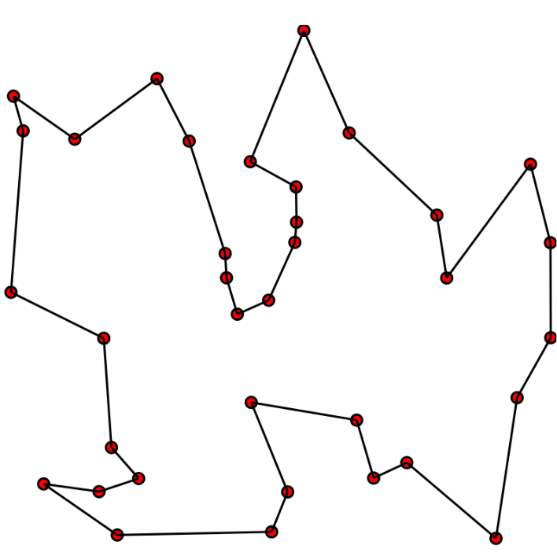

# Cerques locals

## Introducció

Fins ara hem plantejat els problemes com a la **cerca d'un camí en un espai d'estats**. Com sabeu, un espai d'estats inclou:

- Un conjunt d'estats
- Un estat inicial
- Un conjunt d'estats finals
- Un conjunt d'accions que permeten transitar entre estats
- Un cost associat a cada acció (en cerques informades)
- Unes restriccions (en cerques amb restriccions)
- Una heurística (en cerques informades)

Este plantejament és molt útil per a molts problemes, però té certes limitacions. Per exemple, quan l'espai d'estats és molt gran, quan no és fàcil definir accions (fins i tot no hi ha un algorisme concret que ajude a resoldre el problema), o quan només ens interessa trobar un estat final sense preocupar-nos pel camí seguit (o no podem representar el camí) i tampoc és interessa que el camí siga necessàriament òptim, només arribar a una solució possible.

Per exemple, com hem vist en el problema del tall òptim, simplement volem trobar un estat que maximitze o minimitze unes certes funcions o propietats.

En casos on les cerques globals no són pràctiques per qualsevol d'estos motius, podem utilitzar **cerques locals**.

## Definició

Les **cerques locals** són un tipus de tècnica de cerca que es centra en explorar l'espai d'estats a partir d'una única solució candidata, anomenada **estat actual**. A diferència de les **cerques globals**, que exploren tot (o una gran part de)l'espai d'estats, les cerques locals només consideren els estats veïns de l'estat actual per trobar una millor solució. En molts casos milloren l'eficiència i troben solucions acceptables (no necessàriament òptimes) en menys temps.

El problema se modela per a optimitzar el resultat d'una funció d'avaluació $f(s)$, que assigna un valor a cada estat $s$. L'objectiu és trobar un estat que maximitze (o minimitze) aquesta funció. En general quan apliquem un algorisme de cerca local, ens mourem d'un estat(solució possible) al veí (una altra solució possible) que millore el valor de la funció d'avaluació.

Els passos bàsics d'un algorisme de cerca local són:

    - Partim d'una solució inicial, moltes vegades aleatòria
    - Generem un veí de la solució actual (normalment mitjançant una funció que ens permet generar veïns a partir de l'actual)
    - Decidim si ens movem a este veí segons si millora la funció d'avaluació $f$.
    - Repetim el procés fins complir un criteri de parada (sense millora, màxim de passos, resultat òptim, etc.).

Alguns avantatges:

- no necessitem representar tot l'espai d'estats, simplement un estat inicial i una funció que ens permeta generar estat veïns a partir de l'actual
- utilitza menys recursos

## Alguns algorismes de cerca local

Anem a veure algunes formes d'implementar cerques locals. En concret, veurem dos algorismes molt utilitzats: el **hill climbing** i els **algorismes genètics**.

### Hill climbing (ascens de colina)

El **hill climbing** és un algorisme de cerca local que, en cada pas, es mou a un veí que **millore** el valor de la funció objectiu. Quan no hi ha cap veí millor, s'atura en un òptim local. 

Algunes variants són:

- ***Hill climbing simple***: accepta el **primer veí** que millora la funció d'avaluació.
- ***Màxima pendent (steepest-ascent)***: examina tots els veïns i tria el **millor de tots** els que milloren la funció d'avaluació.
- ***Estocàstic***: tria veïns a l'atzar i decideix probabilísticament si moure's o seguir buscant.

L'algorisme pot patir alguns problemes, com ara:

- ***Màxims (o mínims) locals***: punts on cap veí millora, però no és l'òptim global.
- ***Mesetes***: regions on molts estats tenen el mateix valor de la funció d'avaluació; l'algorisme pot quedar-se estancat.
- ***Crestes***: zones on cal fer moviments laterals o petits empitjoraments per després millorar, cosa que el hill climbing pur no permet.

Algunes estratègies per pal·liar aquests problemes són:

- Reinicis aleatoris: executar **hill climbing** moltes vegades des de diferents estats inicials per escapar de mals òptims locals.
- Mètodes relacionats:
    - Temple simulat (simulated annealing): permet **empitjorar** de forma controlada al principi per escapar de màxims locals.
    - Cerca tabú i altres cerques en memòria: eviten tornar a estats ja visitats o poc prometedors.

### Algorismes genètics (AG o GA)

***Els algorismes genètics*** són una tècnica de cerca i optimització inspirada en l'**evolució biològica**: població, selecció natural, creuament i mutació.

Representen cada solució com un ***cromosoma*** (habitualment una cadena de bits, enters o gens), i defineixen una funció de ***fitness*** que indica la qualitat de la solució.

En els algorismes genètics, la **representació** diu com codifiques una solució com a "cromosoma", i la **funció fitness** diu com tan bona és esta solució davant pel problema que vols resoldre.

**Representació (cromosomes)**

La representació és la forma en que escrivim una solució dins de l'algorisme: per exemple, una cadena de bits, una llista d'enters, un vector real, etc.

Ha de complir dues coses:
- Cada cromosoma ha de correspondre's amb una solució vàlida (o fàcil de reparar).
- Els operadors genètics (creuament i mutació) han de tindre sentit.

Exemples comuns de este tipus de representació són problemes d'optimització com per exemple:

- ***Motxilla***: un vector binari on cada bit indica si un objecte s'inclou (1) o no (0) a la motxilla.
- ***N‑reines***: un vector d'enters on la posició $i$ indica la fila de la reina a la columna $i$.

**Funció fitness**

La funció fitness assigna un número real a cada individu, indicant **com de bona** és la solució codificada pel seu cromosoma.

Normalment es dissenya de forma que **valors més alts** signifiquen millors solucions, i s'usa per:
- Avaluar la qualitat de la població en cada generació.
- Determinar la probabilitat de selecció: individus amb més fitness tenen més probabilitat de reproduir-se.

Exemples de funcions fitness per als mateixos problemes que hem comentat abans:
- ***Motxilla***: suma dels valors dels objectes inclosos, penalitzant si es supera la capacitat de la motxilla.
- ***N‑reines***: quantitat de parells de reines que **no** s'ataquen (quant menys, millor)

**Cicle bàsic d'un algorisme genètic**

El cicle bàsic d'un algorisme genètic segueix els següents passos:

1. Generar una **població inicial** de solucions (normalment aleatòria).
2. Evaluar el **fitness** de cada individu (solució).
3. **Seleccionar** individus amb millor fitness per reproduir-se (ruleta, torneig, etc.).
4. Aplicar **creuament** (crossover) per combinar parts de dos pares i generar fills.
5. Aplicar **mutació** amb baixa probabilitat per introduir variació aleatòria.
6. Formar la nova població amb els fills (i a vegades alguns pares elitistes).
7. Repetir el cicle fins a un criteri de parada (quantitat de generacions, llindar de fitness, etc.).

### Relació entre algorismes genètics i cerca local

- Cada individu se pot veure com un punt de l'espai de cerca. Els operadors de creuament i mutació generen **veïns**, de forma que el GA actua com un ***hill climbing en paral·lel*** sobre molts punts a la vegada.

- Es comú hibridar solucions. És a dir, aplicar ***hill climbing*** o altra cerca local a cada individu per "polir" les solucions (algorismes memètics) o usar adaptació lamarckiana on la millora local es reflecteix en el cromosoma heretable.

### Quan usar cada tècnica

- ***Hill climbing***:
    - Útil quan la funció és suau, barata de avaluar i es pot generar un veïnatge raonable; és molt simple i ràpid, però ja hem comentat que pot quedar-se en òptims locals.

- ***Algoritmes genètics***:
    - Interessants quan l'espai és molt gran, multimodal i no es disposa de gradient; la població i la recombinació ajuden a escapar d'òptims locals, a costa de major cost computacional i més paràmetres a ajustar.

## Definició del problema

Per definir un problema de cerca local podem crear una classe abstracta que després implementarem en els nostres problemes concrets. De moment només definim les funcions sense especificar què faran, perquè en cada cas concret haurem d'implementar-les segons el problema que volem resoldre.

```python
class ProblemaCercaLocal(object):
    def __init__(self, inicial=None, **kwds): # **kwds per a altres paràmetres variables (keyword arguments)
        self.__dict__.update(inicial=inicial, **kwds) # assigna atributs a l'objecte de forma dinàmica 

    # la funció estats_successors genera els estats veïns de l'estat actual
    def estats_successors(self, estat):    raise NotImplementedError

    # la funció es_solucio comprova si l'estat actual és una solució
    def es_solucio(self, estat):           raise NotImplementedError

    # la funció funcio_avaluacio retorna el valor de la funció d'avaluació per a l'estat actual
    # esta funció és la que utilitzarem per a comparar estats i decidir quin és millor
    def funcio_avaluacio(self, state):     return NotImplementedError

    # la funció __repr__ retorna una representació en cadena de l'objecte per si volem mostrar-lo
    def __repr__(self):
        return '{}({!r})'.format(
            type(self).__name__, self.inicial)
```

## Exemple: el problema del viatjant

Imagineu que tenim un viatjant que ha de visitar vàries ciutats. Volem optimitzar el recorregut de forma que el repartidor passe per totes les ciutats una sola vegada i torne al punt d'inici, minimitzant la distància total recorreguda. Aquest problema és conegut com el **Problema del viatjant de comerç** (TSP, per les seues sigles en anglès), i és bastant típic en l'àmbit de la cerca local.

- Les **variables** són les **ciutats** i els **dominis** són les **posicions**.
- Les **restriccions** són que **no poden haver dues ciutats en la mateixa posició**.
- Les **solucions** són les **permutacions de les ciutats** que permeten complir les restriccions.



Fixeu-vos que si haguérem d'explorar tot l'espai d'estats, la quantitat d'estats possibles seria molt gran. Per exemple, per a 10 ciutats hi ha $$10! = 3.628.800$$ possibles recorreguts. Això fa que les cerques globals siguen poc pràctiques per a aquest tipus de problemes.

Plantegem el problema com una cerca local, amb un estat inicial que serà una permutació aleatòria de les ciutats i una funció d'avaluació que calcule la distància total del recorregut. Anirem generant estats veïns intercanviant la posició de dues ciutats en el recorregut actual i seleccionant el millor estat veí, segons la funció d'avaluació,fins que no puguem millorar més.


### Implementació

```python
class TSP(ProblemaCercaLocal): # hereta de la classe abstracta ProblemaCercaLocal
    def estats_successors(self, estat): # implementem la funció que genera els estats veïns
        successors = [] # en principi la llista està buida
        for i in range(len(estat)): # recorrem totes les ciutats
            for j in range(i + 1, len(estat)): # i per cada ciutat, totes les altres ciutats
                successor = estat.copy() # fem una còpia de l'estat actual
                # intercanviem les posicions de les ciutats i afegim el nou estat a la llista
                successor[i], successor[j] = successor[j], successor[i]
                successors.append(successor)
        # així hem generat tots els estats veïns possibles intercanviant dues ciutats
        # la llista successors conté tots els estats veïns
        return successors

    def distancia(self, ciutat1, ciutat2): # implementem una funció per calcular la distància entre dues ciutats
        # utilitzant la distancia euclidiana
        return math.sqrt((ciutat1[0] - ciutat2[0]) ** 2 + (ciutat1[1] - ciutat2[1]) ** 2)

    def funcio_avaluacio(self, estat): # implementem la funció d'avaluació
        # la funció d'avaluació serà la inversa de la distància total del recorregut
        distancia = 0
        for i in range(len(estat)):
            distancia += self.distancia(estat[i], estat[(i + 1) % len(estat)])
            # la fórmula anterior suma la distància entre la ciutat actual i la següent
        return 1 / distancia


    @classmethod # mètode de classe per generar un estat inicial aleatori
    def genera_estat_inicial(cls, ciutats): # cls és la classe TSP
        return random.sample(ciutats, len(ciutats))
```

### Backtracking local

Si volem trobar una solució òptima, hem d'utilitzar la tècnica del ***backtracking*** que ja hem vist en altres exemples. La idea és explorar l'espai d'estats de manera exhaustiva, però només mantenint en memòria l'estat actual i els estats veïns. Si arribem a un estat on no podem millorar més, tornem enrere (backtrack) i explorem altres estats veïns per si trobem una solució millor.

### Implementació del backtracking local

Si us fixeu, està tècnica ja l'hem utilitzada anteriorment en altres exemples, com per exemple quan voliem trobar el camí més curt entre dues ciutats en una cerca informada.

```python
def backtracking(problema):
    cua = [problema.inicial]
    visitats = set()
    millor_estat, millor_fitness = None, float('inf')
    while cua:
        estat = cua.pop(0)
        if problema.es_solucio(estat) and problema.funcio_avaluacio(estat) > millor_fitness:
            millor_estat = estat
            millor_fitness = problema.funcio_avaluacio(estat)
        if str(estat) not in visitats:
            visitats.add(str(estat))
            successors = problema.estats_successors(estat)
            for successor in successors:
                if es_compleixen_restriccions(successor): # esta funció no està implementada en este exemple
                    # es tracta de definir una funció que comprove si l'estat successor compleix les restriccions del problema
                    cua.append(successor)

    return millor_estat
```

### Exemple d'execució

```python

# Anem a generar 7 ciutats amb coordenades aleatòries

ciutats = [
    (random.randint(0, 1000),
     random.randint(0, 1000))
    for _ in range(7)
]

# ara creem una instància del problema TSP amb l'estat inicial i les ciutats

tsp = TSP(
    inicial=TSP.genera_estat_inicial(ciutats),
    ciutats=ciutats
)

# i ara executem la funció backtracking per trobar la millor solució

solucio = backtracking(tsp)

print("Millor recorregut:", solucio)
print("Distància total:", 1 / tsp.funcio_avaluacio(solucio))
```

El codi de l'exemple el teniu en un quadern Jupyter anomenat `tsp.ipynb` que podeu descarregar des de la plataforma **Aules** i comprovar si funciona correctament. A més podreu veure vàries solucions possibles. També veureu exemples d'algorismes genètics, sense entrar en profunditat però amb problemes resolts.