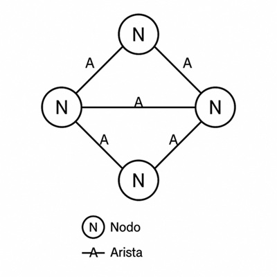
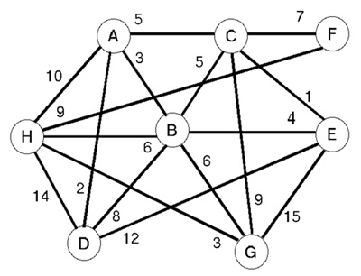
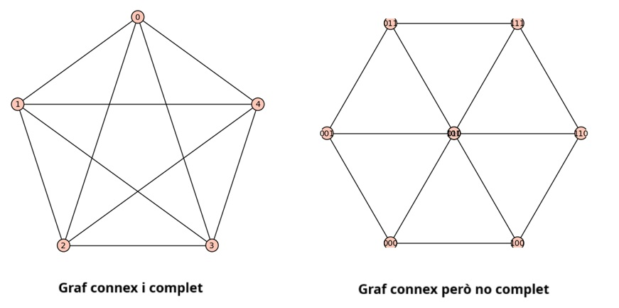
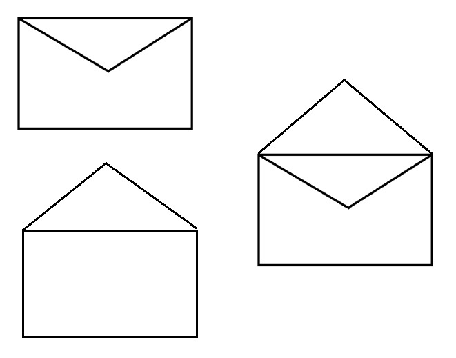
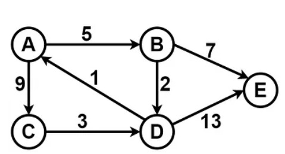
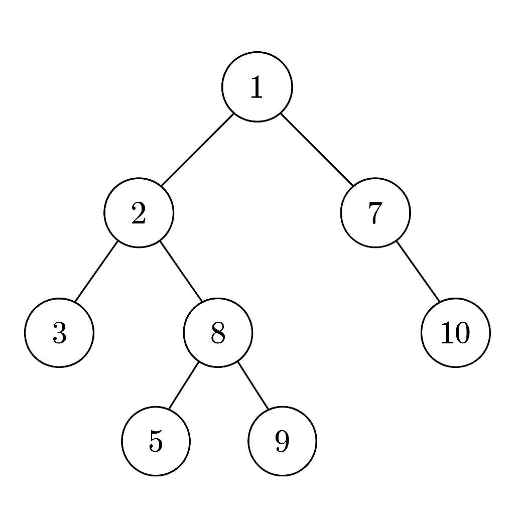
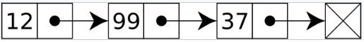
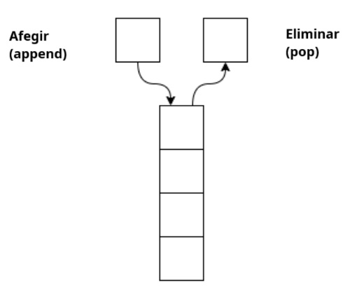
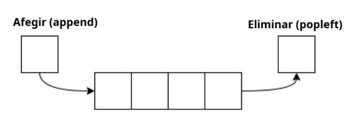

---
# Informació general del document
title: Algorismes de cerca. Conceptes previs.
subtitle: 
authors: 
    - Fidel Oltra Landete
lang: ca
page-background: img/bg.png

# Portada
titlepage: true
titlepage-rule-height: 0
# titlepage-rule-color: AA0000
# titlepage-text-color: AA0000
titlepage-background: img/portada.png
# logo: img/logotext.png

# Taula de continguts
toc: true
toc-own-page: true
toc-title: Continguts

# Capçaleres i peus
header-left: Unitat 03.01 - Algorismes de cerca. Conceptes previs.
header-right: Curs 2025-2026
footer-left: IES Jaume II El Just
footer-right: \thepage/\pageref{LastPage}

# Imatges
float-placement-figure: H
caption-justification: centering

# Llistats de codi
listings-no-page-break: false
listings-disable-line-numbers: false

header-includes:
     - \usepackage{lastpage}
---

# Solució de problemes mitjançant cerques. Conceptes previs.

En esta unitat didàctica treballarem la resolució de problemes mitjançant cerques. Abans de començar a veure tipus de cerques i algorismes, anem a repassar en alguns casos, o a introduir en altres, certs conceptes previs necessaris per a entendre la resta de la unitat. En general el que anem a veure són, principalment, estructures i conceptes matemàtics que ens permeten modelar i implementar, de la manera més eficient, els problemes que volem resoldre, la informació de què disposem i les solucions que busquem. 

## Grafs

Un **graf** és una estructura de dades formada per un conjunt de **nodes** (o vèrtexs) i un conjunt d'**arestes** que connecten parells de nodes. Els grafs són útils per modelar relacions no jeràrquiques entre objectes, com ara xarxes socials, rutes de transport, connexions d'ordinadors, etc.



En el cas de l'ús de grafs per a cerques, els nodes poden representar estats o posicions, i les arestes representen les transicions o moviments entre els diferents estats. Així, un problema de cerca pot ser modelat com un graf on volem trobar un camí des d'un node inicial fins a un node objectiu.

El **grau** d'un node és el nombre d'arestes que estan connectades a ell. Un node amb grau 0 no té connexions, un node amb grau 1 està connectat a un altre node, i així successivament. El grau d'un node és important perquè ens ajuda a entendre la seua connexió amb altres nodes en el graf.

> En la imatge, els nodes de dalt i baix tenen grau 2, ja que estan connectats a dos nodes, mentre que els nodes dels laterals tenen grau 3, ja que estan connectats a tres nodes.

### Tipus de grafs

Pel que fa a les **arestes**, els grafs poden ser **dirigits** o **no dirigits**.

Un graf **no dirigit** és aquell en què les arestes no tenen una direcció específica; és a dir, si hi ha una aresta entre els nodes A i B, es pot anar de A a B i també de B a A. En canvi, un graf **dirigit** té arestes amb una direcció específica, de manera que si hi ha una aresta que apunta de A a B, només es pot anar de A a B i no al revés. Un graf no dirigit es pot representar tal com hem vist a la imatge anterior. Un graf dirigit seria el següent:


En un graf dirigit, si de un node només eixen arestes cap a altres nodes, però ni ha cap aresta que entre en ell, es diu que és un **node font**. Si un node només té arestes entrant però no eixint, es diu que és un **node sumider**. Això és útil per a identificar punts d'inici i final en un graf dirigit.

Un graf **cíclic** és aquell que conté un camí que comença i acaba en el mateix node, passant per altres nodes. És a dir, es pot tornar al punt d'inici després de travessar alguns nodes i arestes. Això és important en molts problemes de cerca on es vol explorar un cicle complet.

Un graf **ponderat** és aquell en què les arestes tenen un valor associat, que pot representar un cost, distància o qualsevol altra mesura. Això és útil quan volem trobar el camí més curt o el camí amb el menor cost entre dos nodes.



Un graf **complet** és aquell en què hi ha una aresta entre cada parell de nodes. És a dir, tots els nodes estan connectats entre si. Això és útil quan volem assegurar-nos que hi ha una connexió directa entre tots els nodes del graf.

Un graf **connex** és aquell en què es pot traçar un camí entre qualsevol parell de nodes sense sortir del graf. És a dir, no hi ha arestes que connecten nodes que estiguin fora del camí traçat. Això és important per a garantir que es pot arribar a qualsevol node des d'un altre node. Un graf complet sempre és connex, però un graf connex no sempre és complet.



Els grafs acíclics i dirigits, coneguts com a **DAGs** (Directed Acyclic Graphs), són molt utilitzats en programació. Per exemple, com veurem més endavant, per  construir **arbres de decisió**.

### Un poc d'història

Els grafs han estat estudiats des de fa molt de temps, i un dels primers problemes relacionats amb ells és el **Problema dels set ponts de Königsberg**, plantejat per Leonhard Euler al segle XVIII. En aquest problema, es tractava de trobar un camí que travessara tots els ponts de la ciutat de Königsberg exactament una vegada (és a dir, sense passar dues vegades pel mateix pont). Euler va demostrar que no era possible introduïnt el concepte de **graf eulerià**: es tracta d'un graf on tots els nodes són de grau parell o si hi ha exactament dos nodes de grau imparell. El graf que representava els ponts de Königsberg no era eulerià, ja que tenia tots els nodes (4) de grau imparell. Aquest problema va portar al desenvolupament de la teoria dels grafs. El camí que connecta tots els nodes sense passar dues vegades per la mateixa aresta es coneix com a **camí eulerià**.


Una forma alternativa del problema demana que el camí passe per tots els ponts i torne al punt d'inici. Un circuit així s'anomena un **circuit eulerià**. Existeix un circuit eulerià si no hi cap node de grau imparell.

**Exercici**: intenteu dibuixar un sobre obert sense alçar el llapis del paper i sense passar dues vegades per la mateixa aresta. Se pot? Per què? I un sobre tancat? I un sobre obert i tancat al mateix temps? 



Ara intenteu fer el mateix amb les tres figures però tampoc podeu passar dues vegades pel mateix node. Quines figures podeu dibuixar i quines no?


Si hi ha dos nodes de grau imparell, el camí eulerià començarà en un d'ells i acabarà en l'altre. Si tots els nodes són de grau parell, el camí eulerià començarà i acabarà en el mateix node. Si hi ha més de dos nodes de grau imparell, no hi ha cap camí eulerià possible.

Un circuit que només passe 1 vegada per cada aresta i per cada node s'anomena **circuit hamiltonià**. Un circuit hamiltonià és prou més complicat de trobar (si és possible) i la seua base matemàtica és molt complexa.

### Representació de grafs amb estructures de dades

Hi ha diverses maneres de representar un graf, les més comunes són:

- **Matriu d'adjacència**: Una matriu quadrada on l'element a la fila i columna (i, j) indica si hi ha una aresta entre els nodes i i j.
- **Llista d'adjacència**: Una llista on cada element correspon a un node i conté una llista dels nodes als quals està connectat per arestes. Si el graf és ponderat, cada element de la llista pot incloure també el pes de l'aresta.

Exemple de matriu d'adjacència:

```
    A B C D
  A 0 1 1 0
  B 1 0 0 1
  C 1 0 0 1
  D 0 1 1 0
```

En un graf ponderat, en lloc de posar un 1 on hi ha una aresta posariem el seu pes:

```
    A B C D
  A 0 2 3 0
  B 2 0 0 1
  C 3 0 0 4
  D 0 1 4 0
```

Exemple de llista d'adjacència sense arestes ponderades:

```
A: B, C
B: A, D
C: A, D
D: B, C
```

Amb arestes ponderades:

```
A: (B,2), (C,3)
B: (A,2), (D,1)
C: (A,3), (D,4)
D: (B,1), (C,4)
```

En este cas la matriu és simètrica, ja que les arestes són no dirigides. En un graf dirigit, la matriu no seria simètrica, ja que les arestes tindrien una direcció específica. Per exemple, el següent graf dirigit:



Se representaria amb una llista d'adjacència com la següent:
```
A: (B,5), (C,9)
B: (D,2), (E,7)
C: (D,3)
D: (A,1), (E,13)
E: 
```

Aquesta representació és útil per a cerques, ja que permet accedir ràpidament als nodes i les seues connexions. La matriu d'adjacència és més eficient per a grafs densos (amb moltes arestes), mentre que la llista d'adjacència és més eficient per a grafs amb poques arestes perquè evitem que els valors 0 ocupen espai en memòria. Compareu la llista que hem vist abans amb la següent matriu d'adjacència que és equivalent:

```
    A B C D E
  A 0 5 9 0 0
  B 0 0 0 2 7
  C 0 0 0 3 0
  D 1 0 0 0 13
  E 0 0 0 0 0
```

Potser en aquest exemple no trobeu gran diferència, però imagineu el cas que el graf tinguera 1000 nodes i només 10 arestes, la matriu d'adjacència ocuparia 1.000.000 de posicions (1.000 x 1.000), mentre que la llista d'adjacència només ocuparia espai per a les 10 arestes.

### Exemple de graf en Python

Per a representar un graf en Python, podem utilitzar una classe que continga una llista d'adjacència. Aquí teniu un exemple senzill:

```python
class Graf:
    def __init__(self):
        self.adjacencia = {}

    def _afegir_aresta(self, node1, node2, pes=1):
        # la funció permet afegir una aresta entre dos nodes amb un pes opcional (per defecte és 1)
        # Si els nodes no existeixen, els inicialitzem
        # node1 i node2 poden ser qualsevol tipus de dades (números, cadenes, etc.) Les guardem com a claus del diccionari
        if node1 not in self.adjacencia:
            self.adjacencia[node1] = []
        if node2 not in self.adjacencia: # només si el graf és no dirigit
            self.adjacencia[node2] = []
        # Afegim l'aresta a la llista d'adjacència
        # Si el graf és dirigit, només afegim l'aresta en una direcció
        # Si és no dirigit, afegim l'aresta en ambdues, com en este cas
        self.adjacencia[node1].append((node2, pes))
        self.adjacencia[node2].append((node1, pes))  # Si el graf és no dirigit

    def _mostrar(self):
        for node, connexions in self.adjacencia.items():
            print(f"{node}: {connexions}")
```

### Tipus de problemes habituals amb grafs

Els grafs són una eina molt potent per a resoldre diversos tipus de problemes. Alguns dels més comuns són:

- **Cerca de camins mínims**: Trobar el camí més curt entre dos nodes.
- **Cerca de connexions**: Determinar si hi ha un camí entre dos nodes.
- **Cerca de components connexos**: Identificar grups de nodes que estan connectats entre si.
- **Cerca de cicles**: Determinar si hi ha un cicle en un graf.
- **Cerca de camins eulerians i hamiltonians**: Trobar camins que compleixen les condicions específiques dels camins i circuits eulerians i hamiltonians.
* **Colorejat de grafs**: nombre mínim de colors per a pintar els nodes d'un graf de manera que dos nodes adjacents no tinguin el mateix color.
* **Ordenació topològica**: trobar un ordre lineal dels nodes d'un graf dirigit acíclic.
* **Flux màxim**: trobar el flux màxim entre dos nodes.

Més endavant veurem quins algorismes podem utilitzar per a resoldre aquests problemes de manera eficient. Per ara, és important entendre com es representen els grafs i quins són els seus components bàsics, ja que això ens permetrà aplicar els algorismes de cerca de manera efectiva.

## Arbres

Un **arbre** és un tipus especial de graf que té una estructura jeràrquica. Un arbre està format per nodes, on cada node pot tenir zero o més nodes fills, però només un node pare. El node superior es coneix com a **arrel** de l'arbre, i els nodes sense fills es coneixen com a **fulles**.

Un arbre és un graf amb les següents característiques:

- És **connex**: hi ha un camí entre qualsevol parell de nodes.
- És **acíclic**: no conté cicles (en este cas, no hi ha arestes d'un node a ell mateix i tampoc camins que tornen al mateix node passant per altres si no és desfent el mateix camí d'anada).
- **No és dirigit**: les arestes no tenen una direcció específica.
- És **únic**: hi ha un camí únic entre qualsevol parell de nodes.

En general els arbres s'utilitzen per a representar estructures jeràrquiques, com ara sistemes de fitxers, organigrames, arbres de decisió, etc.



### Tipus d'arbres

- **Generals**: Un arbre general és aquell en què cada node pot tenir qualsevol quantitat de fills. És el tipus d'arbre més comú i es pot utilitzar per a representar estructures jeràrquiques complexes.
- **Binari**: Un arbre binari és aquell en què cada node pot tenir com a màxim dos fills, anomenats fill esquerre i fill dret. Els arbres binaris són molt utilitzats en informàtica, ja que permeten una cerca eficient i una representació compacta de dades.
- **Arbres binaris de cerca (BST)**: Un arbre binari de cerca és un arbre binari en què els nodes estan ordenats de manera que el valor de cada node és major que el valor del seu fill esquerre i menor que el valor del seu fill dret. Això permet una cerca eficient de valors.
- **n-ari**: Un arbre n-ari és aquell en què cada node pot tenir com a màxim *n* fills. És una generalització dels arbres binaris i es pot utilitzar per a representar estructures jeràrquiques amb més de dos fills per node.
* **Heaps**: són arbres binaris balancejats que compleixen alguna propietat addicional. Els heaps es poden utilitzar per a implementar cues de prioritat. Exemples de heaps són els **max-heaps** (cada node pare és major que tots els seus fills) i els **min-heaps** (cada node pare és menor que tots els seus fills).

[Heaps en Wikipedia](https://es.wikipedia.org/wiki/Montículo_(informática))

En general els arbres més utilitzats en algorismes de cerca són els arbres binaris de cerca i els arbres n-aris. Sobretot els BST són especialment útils per a cerques eficients, ja que permeten una cerca, inserció i eliminació de valors en temps O(log n) en el millor dels casos.


### Representació d'arbres amb estructures de dades

Els arbres es poden representar de diverses maneres, encara que la més comuna és mitjançant una llista enllaçada on cada node té un valor i referències als seus nodes fills. Per exemple, un node d'un arbre binari pot tenir la següent estructura:

```python
class Node:
    def __init__(self, valor):
        self.valor = valor
        self.fill_esquerre = None
        self.fill_dret = None
```

I ara, implementar un arbre binari de cerca seria tan senzill com crear una classe que continga un node arrel i mètodes per a afegir nodes, cercar valors, etc. Per exemple:

```python
class ArbreBinari:
    def __init__(self):
        self.arrel = None # inicialitzem l'arbre amb l'arrel com a None (buit)

    def _afegir(self, valor):
        if self.arrel is None: # si l'arbre està buit, el nou valor es converteix en l'arrel
            self.arrel = Node(valor)
        else: # si l'arbre ja té nodes, afegim el valor de manera recursiva per a col·locar-lo en la posició correcta
            self._afegir_recursiu(self.arrel, valor)

    def _afegir_recursiu(self, node, valor):
        if valor < node.valor: # si el valor és menor que el node actual, anem al fill esquerre
            if node.fill_esquerre is None: # si no hi ha fill esquerre, inserim el nou node com a fill esquerre
                node.fill_esquerre = Node(valor)
            else: # si ja hi ha fill esquerre, repetim l'operació amb el fill esquerre
                self._afegir_recursiu(node.fill_esquerre, valor)
        else: # si el valor és major o igual que el node actual, anem al fill dret
            if node.fill_dret is None: # si no hi ha fill dret, inserim el nou node com a fill dret
                node.fill_dret = Node(valor)
            else: # si ja hi ha fill dret, repetim l'operació amb el fill dret
                self._afegir_recursiu(node.fill_dret, valor)
```

- L'arbre té un node arrel, inicialment buit.
- El mètode `afegir` permet afegir un valor a l'arbre. Si l'arbre està buit, el valor afegit se converteix en el node arrel.
- Si l'arbre ja té nodes, el mètode `_afegir_recursiu` s'encarrega de col·locar el nou valor en la posició correcta segons les regles d'un arbre binari de cerca: 
    - si el valor és menor que el node actual i no hi ha fill esquerre, inserim el nou node com a fill esquerre del node actual
    - si el valor és menor que el node actual i ja hi ha fill esquerre, repetim l'operació  `_afegir_recursiu` amb el fill esquerre
    - si el valor és major que el node actual i no hi ha fill dret, inserim el nou node com a fill dret del node actual
    - si el valor és major que el node actual i ja hi ha fill dret, repetim l'operació `_afegir_recursiu` amb el fill dret

### Recorregut d'arbres binaris

Per recórrer un arbre, hi ha diverses estratègies, les més comunes són:

- **Preordre**: Visitem el node actual, després el fill esquerre i finalment el fill dret. Això és útil per a crear una còpia de l'arbre o per a imprimir els nodes en ordre.
- **Inordre**: Visitem primer el fill esquerre, després el node actual i finalment el fill dret. Això és útil per a obtenir els valors d'un arbre binari de cerca en ordre ascendent.
- **Postordre**: Visitem primer el fill esquerre, després el fill dret i finalment el node actual. Això és útil per a eliminar nodes de l'arbre o per a calcular valors agregats.

Si l'arbre és un arbre binari de cerca:

- el recorregut **inordre** ens donarà els valors en ordre ascendent. Això és perquè els valors dels nodes del fill esquerre són sempre menors que el valor del node actual, i els valors dels nodes del fill dret són sempre majors.
- el recorregut **preordre** ens donarà els valors en l'ordre en què es van afegir a l'arbre, començant per l'arrel.
- el recorregut **postordre** ens donarà els valors en l'ordre en què es van eliminar de l'arbre, començant pels nodes fulles i acabant per l'arrel.
- si volem **trobar un valor concret**, podem utilitzar un recorregut **binaritzat**: com que els arbres binaris de cerca estan ordenats, podem comparar el valor que busquem amb el valor del node actual i decidir si continuar buscant al fill esquerre o al fill dret. Això ens permet reduir el nombre de nodes que hem de visitar i fer la cerca més eficient.

### Exercicis

Ara intenteu fer els exercicis del quadern Jupyter `arbres.ipynb` que trobareu a Aules. Veureu que ja teniu la classe `Node`i la classe `ArbreBinariCerca` amb els mètodes necessaris per afegir nodes i recórrer l'arbre en inordre. Feu els exercicis que falten.

> Podeu utilitzar les llibreries externes de Python **anytree** o **binarytree** per a treballar amb arbres de manera més senzilla i eficient. Estes llibreries proporcionen funcions i mètodes per a crear, manipular i visualitzar arbres de manera senzilla i bastant intuïtiva. Si voleu investigar un poc, ací teniu els enllaços.

[anytree en PyPI](https://pypi.org/project/anytree/)

[binarytree en PyPI](https://pypi.org/project/binarytree/)

## Llistes, piles i cues

Les **llistes**, **piles** i **cues** són estructures de dades fonamentals que ens permeten emmagatzemar i gestionar col·leccions d'elements de manera eficient. Cada una d'elles té les seues pròpies característiques i usos específics que veurem a continuació.

### Llistes

Una **llista** és una estructura de dades que permet emmagatzemar una col·lecció d'elements. Les llistes poden ser dinàmiques, és a dir, poden canviar de mida durant l'execució del programa, o estàtiques, on la mida es defineix en el moment de la creació. 

> En Python les llistes són més útils que els vectors quan treballem amb dades molt volàtils, ja que les llistes poden canviar de mida i permeten afegir o eliminar elements amb més facilitat

Una **llista enllaçada** és una llista on cada element (o node) conté un valor i una referència al següent element de la llista. Això permet una inserció i eliminació eficient d'elements, encara que accedir a un element específic pot ser més lent que en una llista estàtica ja que el recorregut sempre és sequencial. Sempre serà més útil, per tant, si hi ha un cert tipus d'ordenació.



En Python, podem implementar una llista enllaçada utilitzant classes per als nodes i la llista. Cada node té un valor i una referència al següent node. 

```python
class Node:
    def __init__(self, valor):
        self.valor = valor
        self.seguent = None

class LlistaEnllaçada:
    def __init__(self):
        self.cap = None

    def afegir(self, valor):
        nou_node = Node(valor)
        if not self.cap:
            self.cap = nou_node
        else:
            node_actual = self.cap
            while node_actual.seguent:
                node_actual = node_actual.seguent
            node_actual.seguent = nou_node

    def imprimir(self):
        node_actual = self.cap
        while node_actual:
            print(node_actual.valor)
            node_actual = node_actual.seguent
```

Si volem mantindre la llista ordenada, hem d'implementar mètodes per a inserir un node en una posició específica. Potser també voldrem eliminar nodes. Tot això ho aconseguim simplement canviant les referències dels nodes implicats.

- per a **inserir** un node, recorrem la llista fins a trobar la posició correcta. El node següent del node anterior on volem fer la inserció serà el node següent del nou node. El node següent del node anterior serà el nou node.
- per a **eliminar** un node, recorrem la llista fins a trobar el node que volem eliminar. Modificarem la referència del node anterior per a que apunte al següent del node eliminar (així ens saltem el node eliminat).

En Python tenim la classe **List** per a guardar col·leccions d'elements. Aquesta classe proporciona mètodes per a afegir, eliminar i accedir als elements de manera eficient. Per a llistes enllaçades no hi ha cap estructura concreta però ja hem vist com implementar-la utilitzant classes.

En Python també podem implementar una llista utilitzant la classe ***collections.deque***. Amb **deque** podem crear una llista **doblement enllaçada** (cada element guarda dues referències, al següent i també a l'anterior) que permet afegir i eliminar elements tant pel principi (**appendleft**) com pel final (**append**) de la llista. Això és útil per a implementar estructures de dades com piles i cues, que veurem més endavant. Per a afegir elements en qualsevol posició hem de fer com hem vist abans, recorrent la llista fins a trobar la posició correcta i afegint/eliminant el node corresponent.

### Piles

Una **pila** és un tipus especial de llista que segueix el principi **LIFO** (Last In, First Out). És a dir, l'últim element afegit és el primer en ser eliminat. Això implica que els elements s'afegixen i s'eliminen sempre pel mateix extrem de la pila.



 Si volem implementar una pila utilitzant ***deque***, afegirem i eliminarem els elements sempre pel final de la llista.

```python
from collections import deque

pila = deque()

# Afegir elements a la pila
pila.append(1)
pila.append(2)
pila.append(3)

# Eliminar elements de la pila
print(pila.pop())  # mostra el 3 i l'elimina
print(pila.pop())  # mostra el 2 i l'elimina
print(pila.pop())  # mostra el 1 i l'elimina
```

### Cues

Una **cua** és un altre tipus especial de llista que segueix el principi **FIFO** (First In, First Out). És a dir, el primer element afegit és el primer en ser eliminat. Això implica que els elements s'afegiran pel principi de la cua i s'eliminaran pel final. Ací podem utilitzar també la classe ***deque*** afegint els elements amb **append** i eliminant-los amb **popleft**.



```python
from collections import deque

cua = deque()

# Afegir elements a la cua
cua.append(1)
cua.append(2)
cua.append(3)

# Eliminar elements de la cua
print(cua.popleft())  # mostra el 1 i l'elimina
print(cua.popleft())  # mostra el 2 i l'elimina
print(cua.popleft())  # mostra el 3 i l'elimina
```

## Complexitat computacional

La **complexitat computacional** és una mesura de l'eficiència d'un algorisme en termes de temps i espai que necessita per a resoldre un problema. És important perquè ens ajuda a comparar diferents algorismes i a triar el més adequat per a un problema concret.

### Complexitat temporal

La **complexitat temporal** és una mesura de l'eficiència d'un algorisme en funció de la quantitat de dades amb les quals treballem. Normalment utilitzem la **notació asintòtica** per a descriure la complexitat temporal, que s'escriu O(x) on x és una funció sobre la quantitat d'elements. És important saber que la complexitat temporal no ens diu el temps exacte que trigarà un algorisme, sinó com creix el temps d'execució a mesura que augmenta la quantitat de dades.

Anem a veure un exemple senzill. Imaginem un vector. Si volem buscar un element i sabem que quina posició està, la complexitat temporal seria **O(1)** perquè només necessitem un temps per a trobar-lo. Si no sabem la posició, la complexitat temporal seria **O(n)**, que vol dir que en el pitjor dels casos necessitarem tants passos com elements té el vector.

Un exemple un poc més complicat però senzill d'entendre. En un arbre binari de cerca, la complexitat temporal seria **O(log n)**, ja que cada vegada que comparem un valor reduïm a la meitat el nombre de nodes que hem de visitar. Teniu en compte que, en informàtica, la notació **log** (sense base) normalment es refereix al logaritme en base 2, ja que estem parlant de cerques binàries. Això vol dir que si tenim un arbre amb 1000 nodes, necessitarem com a màxim 10 passos per a trobar un valor (ja que 2^10 = 1024).

En el pitjor dels casos, si un arbre està desbalancejat i té una forma lineal (com una llista), la complexitat temporal seria **O(n)** igual que en qualsevol vector.

### Complexitat espacial

La **complexitat espacial** és una mesura de l'eficiència d'un algorisme en funció de la quantitat d'espai de memòria que necessita per a resoldre un problema. Igual que amb la complexitat temporal, utilitzem la notació asintòtica per a descriure la complexitat espacial.

La complexitat espacial se calcula en funció de la quantitat de dades però també de les estructures i algorismes que utilitzem. Per exemple, si utilitzem un vector per a emmagatzemar dades, la complexitat espacial seria **O(n)**, ja que necessitem espai per a cada element del vector. Si utilitzem una llista enllaçada, la complexitat espacial també seria **O(n)**, però amb un cost addicional per a les referències als nodes. Ho anirem veient a mesura que anem treballant diferents algorismes.

## Exercicis

En un document adjunt teniu una sèrie d'exercicis per a practicar els conceptes que hem vist en esta unitat.

