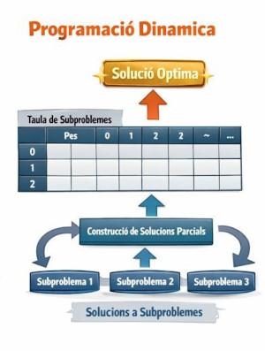

# Programació Dinàmica

Anem a veure altres tècniques d'optimització que no se consideren com a cerca local. En este cas, la **programació dinàmica** que és una tècnica molt potent per resoldre problemes d'optimització que tenen una estructura específica.

## Què és la Programació Dinàmica?

La programació dinàmica se basa en la descomposició d'un problema en subproblemes més xicotets i resoldre'ls de manera eficient emmagatzemant els resultats de subproblemes ja resolts per evitar càlculs repetitius. Aquesta tècnica és especialment útil per a problemes d'optimització on es poden identificar subproblemes que es repeteixen.

La programació dinàmica és útil quan un problema té les següents dues característiques:

1. **Subestructura òptima:** La solució òptima d'un problema pot construir-se a partir de les solucions òptimes dels seus subproblemes.
2. **Superposició de subproblemes:** El problema pot dividir-se en subproblemes que es resolen diverses vegades.

Es veurà millor amb un exemple, que a més resoldrem de dues maneres per poder comparar diferents mètodes.

## Exemple: el problema de la motxilla (Knapsack Problem) amb programació dinàmica

El **problema de la motxilla** és un problema clàssic d'optimització que es pot resoldre mitjançant programació dinàmica. Tenim una motxilla amb una capacitat màxima `W` i un conjunt d'objectes, cadascun amb un pes i un valor associat. L'objectiu és determinar quins objectes incloure a la motxilla per maximitzar el valor total sense excedir la capacitat màxima. El problema és extensible a qualsevol contenidor que tinga una capacitat limitada i que es vulga omplir de manera òptima tenint en compte certs criteris (quantitat d'elements, pes total, valor total, etc.).

El problema se pot resoldre amb programació dinàmica perquè el valor màxim que es pot obtenir amb una capacitat de motxilla `W` utilitzant els primers `i` objectes depèn del valor màxim obtingut utilitzant els primers `i-1` objectes amb una capacitat menor o igual a `W`. Per tant, estem davant d'un cas de **subestructura òptima** i **superposició de subproblemes**.

### Com Funciona l'Algorisme de Programació Dinàmica en el Problema de la Motxilla?

En el cas del **problema de la motxilla**, la idea és construir una **taula (matriu DP)** que ens permeta emmagatzemar les solucions parcials de subproblemes, de manera que puguem reutilitzar-les en lloc de recalcular-les cada vegada.

L'enfocament és el següent:

#### 1. **Definició de la taula DP:**

Creem una taula `dp[i][w]`, on:

* `i` és l'índex dels objectes considerats (des de 0 fins a `n` objectes).
* `w` és el pes de la motxilla considerat (des de 0 fins al pes màxim `W` de la motxilla).

Cada cel·la `dp[i][w]` representarà el valor màxim que es pot obtenir utilitzant els primers `i` objectes i un pes màxim de `w`.

#### 2. **Inicialització de la taula:**

* `dp[0][w] = 0` per a tot `w` (si no hi ha objectes, el valor màxim és 0).
* `dp[i][0] = 0` per a tot `i` (si el pes de la motxilla és 0, el valor màxim també és 0).

#### 3. **Omplir la taula:**

Per a cada objecte `i` (des de 1 fins a `n`), i per a cada pes `w` (des de 1 fins a `W`), es pren una decisió:

* **No incloure l'objecte `i` a la motxilla**: el valor de `dp[i][w]` seria per tant el mateix que `dp[i-1][w]` (el valor màxim considerant només els primers `i-1` objectes i el mateix pes).
* **Incloure l'objecte `i` a la motxilla**: Si el pes de l'objecte `i` és menor o igual a `w`, el valor seria `dp[i-1][w-pes_objecte] + valor_objecte` (el valor màxim considerant els primers `i-1` objectes i el pes restant després d'incloure l'objecte `i`).
Al final, el valor màxim es troba a `dp[n][W]`, que és el valor màxim que es pot obtenir amb tots els objectes i el pes màxim `W`.

#### 4. **Recuperació de la solució òptima:**

Un cop la taula està plena, podem retrocedir des de `dp[n][W]` per recuperar quins objectes van ser seleccionats a la motxilla. Si `dp[i][w]` no és igual a `dp[i-1][w]`, significa que l'objecte `i` va ser inclòs a la solució.

>En un quadern Jupyter que vos adjuntaré trobareu la solució implementada en Python.

### **Comparació de la Programació Dinàmica amb altres mètodes**

#### **1. Força Bruta:**

La **força bruta** implica provar totes les combinacions possibles d'objectes i verificar quina d'elles compleix amb la condició de no excedir el pes màxim i té el valor més alt. La quantitat de combinacions creix exponencialment amb la quantitat d'objectes, per la qual cosa este enfocament pot ser vàlid per a problemes xicotets, però segons se va incrementant la complexitat acaba per no ser pràctic.

* **Avantatge de la PD sobre força bruta:** La programació dinàmica és molt més eficient perquè **evita recalcular subproblemes**. Per tant pot aplicar-se a problemes de major escala sense tornar-se ineficient.

#### **2. Algoritmes Genètics:**

Els **algoritmes genètics (AG)** són una tècnica d'optimització basada en l'evolució biològica (selecció natural, creuaments, mutacions). Tot i que poden ser molt poderosos per trobar solucions aproximades a problemes complexos (com el **problema de la motxilla** o problemes amb molts paràmetres), els AG requereixen una configuració acurada de paràmetres i un procés d'evolució que pot ser costós en termes de temps.

* **Complexitat dels algoritmes genètics:** Depèn de la implementació, però en general, els AG poden requerir moltes generacions i avaluacions per trobar una bona solució, cosa que pot ser ineficient per a problemes amb estructures simples i subproblemes que poden ser resolts eficientment.

* **Avantatge de la PD sobre els AG:** La PD és més **determinística i eficient** quan el problema té una estructura òptima ben definida i subproblemes que es superposen. Els AG, per altra banda, són més adequats per a problemes de cerca en espais de solucions grans i complexos on no existeix una estructura clara.

>De totes formes podrem comparar la solució que dóna la programació dinàmica amb la que dóna un algoritme genètic en el mateix quadern Jupyter que vos adjuntaré.

#### **3. Cerques locals:**

La **programació dinàmica** no es classifica com una **cerca local**. Tot i que en certs casos pot semblar que "explora" solucions locals (especialment en omplir una taula de subproblemes), el mètode és diferent. La PD busca **resoldre subproblemes de manera òptima** i **emmagatzemar les solucions parcials**, cosa que la fa diferent de la cerca local. En la cerca local, normalment es parteix d'una solució inicial i s'exploren solucions veïnes o properes a aquesta, buscant millorar de manera iterativa, mentre que la PD és una tècnica estructurada i sistemàtica que resol subproblemes de manera global.

#### **Resum de Comparacions:**

(n significa la quantitat d'objectes i W la capacitat màxima de la motxilla)

| Enfocament                   | Complexitat    | Avantatges                                          | Desavantatges                                                   |
| ---------------------------- | --------------- | ---------------------------------------------------- | ---------------------------------------------------------------- |
| **Força bruta**             | (O(2^n))        | Simple de entendre i implementar.                    | Ineficient per a problemes grans.                              |
| **Programació dinàmica**    | (O(n x W)) | Eficient, resol subproblemes de manera òptima.   | Requereix espai addicional per a la taula DP.                     |
| **Algoritmes genètics**     | Variable        | Útil per a espais grans i sense estructura clara.   | Costós en termes de temps i paràmetres difícils d'ajustar. |
| **Cerca Local (Hill Climbing, Simulated Annealing)** | Variable                  | Eficient per trobar solucions aproximades ràpidament. | No garanteix la solució òptima, pot quedar atrapat en mínims locals.  
  |

